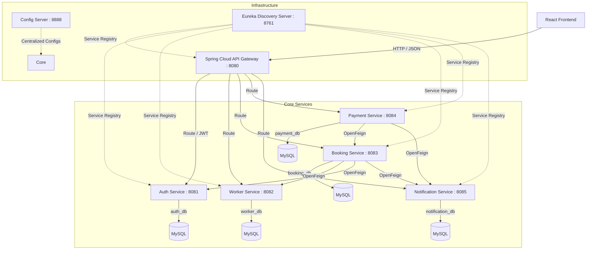
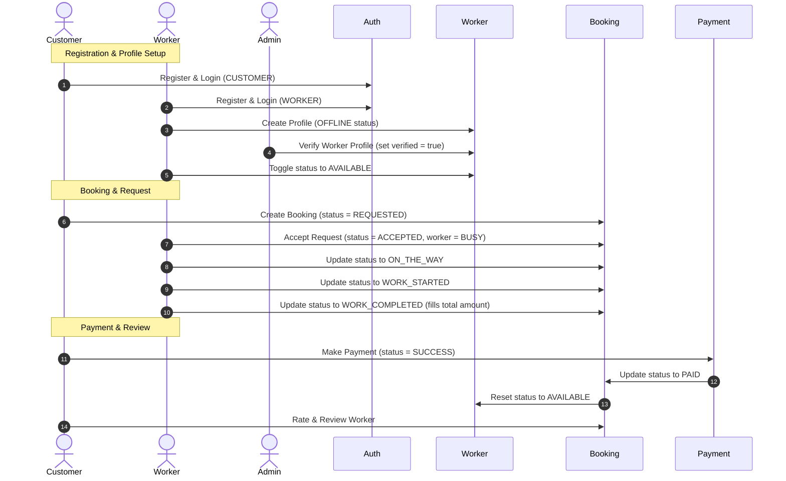

# 🛠️ NearFix — Emergency Local Skill Marketplace

> **SkillConnect Emergency Marketplace**
> Connects customers with nearby verified workers for real-time emergency service requests (Electricians, Plumbers, Mechanics, Carpenters, AC Technicians).

---

## 📌 Table of Contents
1. [Overview](#-overview)
2. [System Architecture](#%EF%B8%8F-system-architecture)
3. [Technology Stack](#-technology-stack)
4. [Complete Business Flow](#-complete-business-flow)
5. [Project Structure](#-project-structure)
6. [Sub-Project Documentation](#-sub-project-documentation)
7. [Getting Started (Run Instructions)](#-getting-started-run-instructions)

---

## 🔍 Overview
Finding a trusted skilled worker (electrician, plumber, etc.) during an emergency is historically difficult. Traditional marketplace platforms focus on scheduled services rather than immediate, location-based dispatch. 

**NearFix** provides a premium, location-aware, real-time marketplace that connects customers in distress directly with nearby, active, and verified skilled workers.

### Core Value Propositions
* **Real-time SOS Dispatch:** A customer creates a booking which is instantly visible to available workers in the same city.
* **Grab/Bolt Inspired UI:** Sleek, modern dark-navy and teal styling with responsive panels.
* **Role-Based Portals:** Dedicated customer tracking screens, worker availability HUDs, and administrative compliance consoles.
* **Robust Microservices:** Fault-tolerant Spring Cloud architecture utilizing service discovery, dynamic routing, and centralized config management.

---

## 🏗️ System Architecture

NearFix is built as a distributed microservices system on the backend, communicating with a single-page React frontend.



---

## 🛠 Technology Stack

### Backend Services
* **Language & Runtime:** Java 21, Spring Boot 3.x
* **Security & Authentication:** Spring Security, JWT (JSON Web Tokens), BCrypt password hashing
* **Cloud Infrastructure:** Spring Cloud Gateway, Eureka Service Registry, Spring Cloud Config Server
* **Inter-service Communication:** OpenFeign declarative REST clients
* **Resilience:** Circuit Breakers & Rate Limiting via Resilience4j
* **Databases:** MySQL / H2 relational databases with Hibernate & Spring Data JPA

### Frontend App
* **Framework:** React 18, Vite build tool
* **Styling & UI Components:** Material UI (MUI) v5, React Bootstrap, Lucide React (Icons)
* **API Communication:** Axios with request/response interceptors (attaching JWTs dynamically)
* **State Management:** React Context API (Auth, Theme, Toast contexts)
* **Data Visualization:** Recharts for metrics & analytics dashboards

---

## 🔄 Complete Business Flow



---

## 📂 Project Structure

```
nearfix/
├── backend/                # Spring Boot microservices directory
│   ├── api-gateway/        # Edge router and gateway filter logic
│   ├── auth-service/       # Identity management and security token generation
│   ├── booking-service/    # Booking management and SOS orchestration
│   ├── config-repo/        # Config server configuration files (.yml)
│   ├── config-server/      # Spring Cloud config server
│   ├── eureka-server/      # Eureka discovery registry
│   ├── notification-service/ # Internal persistent notification logs
│   ├── payment-service/    # Transaction processor
│   ├── worker-service/     # Worker profile directory & search index
│   └── pom.xml             # Parent Maven build file
│
└── frontend/               # React client repository
    ├── db.json             # Simulated mock database (for json-server)
    ├── package.json        # Frontend scripts and dependencies
    └── src/                # React source code components
```

---

## 📖 Sub-Project Documentation

For specific setup steps, database configurations, and developer API references, please check the respective README files:

1. **[Backend Microservices Documentation](file:///D:/nearfix/backend/README.md):** Architectural setup, Spring Boot application setup, and API specifications.
2. **[Frontend Portal Documentation](file:///D:/nearfix/frontend/README.md):** User interface design guides, mock backend config, and UI component structures.

---

## 🚀 Getting Started (Run Instructions)

To run the full project in dynamic development mode:

### 1. Backend Setup
Make sure you have **Java 21** and **Maven** installed, along with a running **MySQL** instance.
1. Spin up the infrastructure components:
   * [Eureka Server](file:///D:/nearfix/backend/eureka-server) (Port `8761`)
   * [Config Server](file:///D:/nearfix/backend/config-server) (Port `8888`)
2. Start the API Gateway:
   * [API Gateway](file:///D:/nearfix/backend/api-gateway) (Port `8080`)
3. Launch the remaining services:
   * [Auth Service](file:///D:/nearfix/backend/auth-service), [Worker Service](file:///D:/nearfix/backend/worker-service), [Booking Service](file:///D:/nearfix/backend/booking-service), [Payment Service](file:///D:/nearfix/backend/payment-service), and [Notification Service](file:///D:/nearfix/backend/notification-service).

For details, refer to the [Backend Run Guide](file:///D:/nearfix/backend/README.md#-running-the-microservices-locally).

### 2. Frontend Setup
1. Open a new terminal.
2. Navigate to the `frontend` folder:
   ```bash
   cd frontend
   npm install --legacy-peer-deps
   ```
3. Start the mock backend server (or redirect the API endpoints to the live gateway at port `8080`):
   ```bash
   npm run server
   ```
4. Run the React Vite app:
   ```bash
   npm run dev
   ```
   Open [http://localhost:5173/](http://localhost:5173/) to interact with the platform.

For credentials and visual mock layouts, refer to the [Frontend Guide](file:///D:/nearfix/frontend/README.md#-portal-login-credentials).
